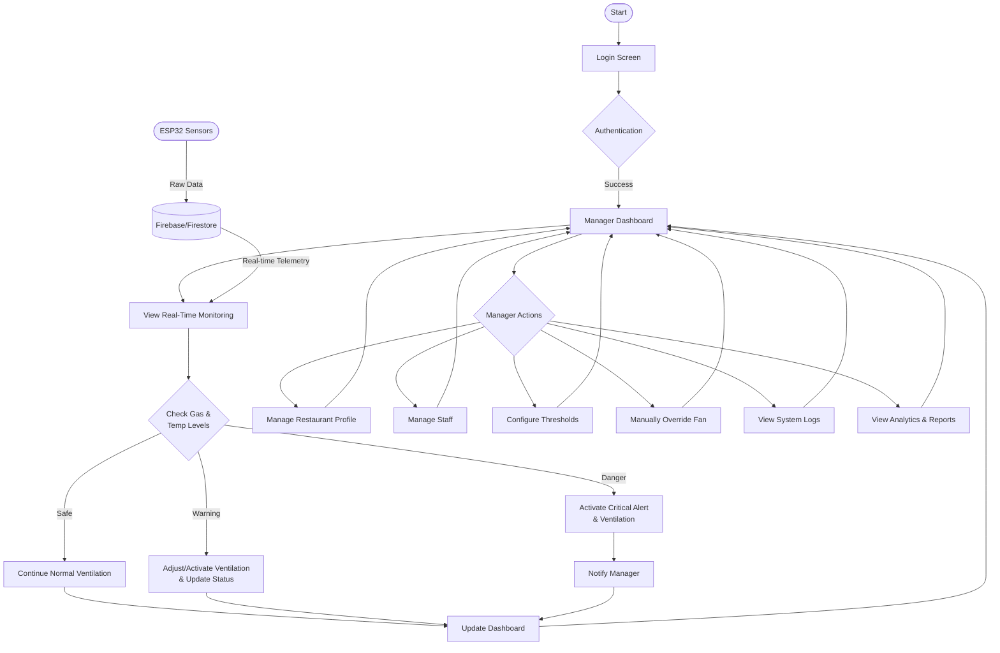
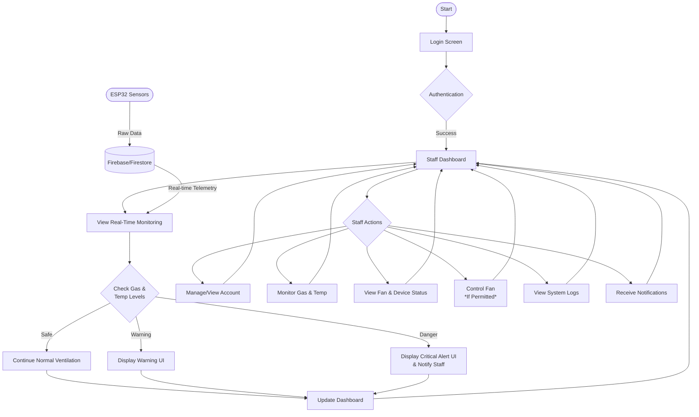

# ScentGuard Vent System Operational Flowcharts

This document outlines the workflows for the two primary user roles in the ScentGuard system: the Manager and the Staff.

## 1. Manager Flowchart
The Manager role has full control over the system, including configuration and personnel management.

---

## 2. Staff Flowchart
The Staff role focuses on monitoring and responding to immediate environmental conditions.

