# ScentGuard Context Diagram (Level 0) - Updated
*Based on actual project implementation*

Copy and paste this code into the [Mermaid Live Editor](https://mermaid.live/) to generate the visual diagram.

```mermaid
graph TD
    %% Central System
    System((0 <br/> ScentGuard <br/> Platform))

    %% External Entities
    Manager[Manager User Role]
    Staff[Staff User Role]
    IoTDevice[IoT Hardware Unit <br/> ESP32 + MQ135 + Relay]
    AndroidOS[Android System <br/> Notifications/Audio]

    %% Manager Flows
    Manager -- "1. Auth & Onboarding (AuthRepository)" --> System
    Manager -- "2. Manual Fan Control (updateFanMode)" --> System
    Manager -- "3. Threshold Config (Firestore)" --> System
    System -- "4. Real-time Metrics (liveRestaurantData)" --> Manager
    System -- "5. Analytics (ChartRepository)" --> Manager
    System -- "6. Critical Alerts (ScentGuardWatcherService)" --> Manager
    System -- "7. Incident History (HistoryRepository)" --> Manager

    %% Staff Flows
    Staff -- "1. Authentication" --> System
    System -- "2. Real-time Air Quality Status" --> Staff
    System -- "3. Safety Notifications" --> Staff
    System -- "4. Recent Activity Logs" --> Staff

    %% IoT Hardware Flows
    IoTDevice -- "1. Gas PPM & Temp Data" --> System
    IoTDevice -- "2. Heartbeat (lastSeen Timestamp)" --> System
    System -- "3. Fan Relay Control (fanMode/fanStatus)" --> IoTDevice

    %% Android System Flows
    System -- "1. Push Notifications (Broadcast)" --> AndroidOS
    System -- "2. Audio Alarm (AlertAudioManager)" --> AndroidOS
    AndroidOS -- "3. Alarm Acknowledgment (ACTION_STOP_ALARM)" --> System
```

